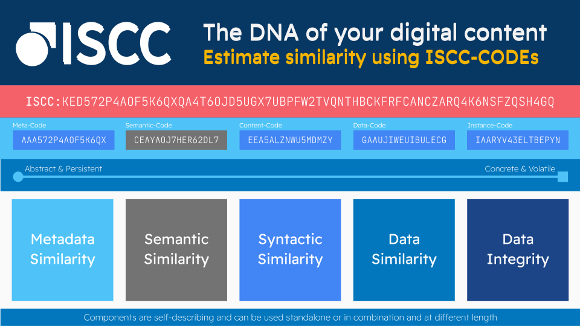

# ISCC Software Development Kit (iscc-sdk)

[](https://github.com/iscc/iscc-sdk/actions/workflows/ci.yml)
[](https://pypi.python.org/pypi/iscc-sdk/)
[](https://codecov.io/gh/iscc/iscc-sdk)
[](https://www.codacy.com/gh/iscc/iscc-sdk/dashboard)
[](https://pepy.tech/project/iscc-sdk)
[](https://github.com/iscc/iscc-sdk/blob/main/LICENSE)

A comprehensive Python toolkit for creating and managing [ISCC](https://core.iscc.codes)
(*International Standard Content Code*) identifiers for digital media assets.

## Table of Contents

- [Overview](#overview)
  - [What is an ISCC?](#what-is-an-iscc)
  - [What is iscc-sdk?](#what-is-iscc-sdk)
- [Features](#features)
- [Requirements](#requirements)
- [Installation](#installation)
- [Usage](#usage)
  - [Python API](#python-api)
  - [Command Line Interface](#command-line-interface)
- [Documentation](#documentation)
- [Troubleshooting](#troubleshooting)
- [Project Status](#project-status)
- [Contributing](#contributing)
- [License](#license)

## Overview

### What is an ISCC?

The **International Standard Content Code (ISCC)** is a content-dependent, similarity-preserving
identifier and fingerprint system for digital content, standardized as
[ISO 24138:2024](https://www.iso.org/standard/77899.html).

ISCCs are neither manually nor automatically assigned but are derived from the digital content
itself. Generated algorithmically using various hash algorithms, ISCCs create composite identifiers
with similarity-preserving properties (soft hashes) that can be independently derived by unrelated
parties from the same media asset.

Digital content is dynamic - continuously re-encoded, resized, and re-compressed as it travels
through complex networks. The ISCC remains robust across these transformations while preserving
estimates of data, content, and metadata similarity.



The component-based structure of ISCC identifies content at multiple levels of abstraction, creating
a multi-layered fingerprint:

- **Meta-Code** - Encodes syntactic/lexical **metadata** similarity
- **Semantic-Code** - Encodes semantic/conceptual **content** similarity (reserved in ISO 24138:2024
  but algorithms not yet defined)
- **Content-Codes** - Type-specific codes (Text, Image, Audio, Video) that encode
  perceptual/syntactic/structural **content** similarity
- **Data-Code** - Encodes raw **data** similarity, preserving similarity across different encodings
- **Instance-Code** - Identifies exact **data** like a checksum or cryptographic hash, detecting
  even minimal changes

These components work together to create a robust, similarity-preserving identifier that remains
stable despite modifications to the underlying digital asset. With this multi-layered approach, the
ISCC can track content throughout its lifecycle, even as it's re-encoded, resized, or re-compressed.

Each component is self-describing, modular, and can be used separately or together, enabling ISCCs
to support numerous digital asset management use-cases across all domains concerned with producing,
processing, and distributing digital information (science, journalism, books, music, film, etc.):

- Content deduplication and discovery
- Database synchronization and indexing
- Integrity verification and timestamping
- Versioning and data provenance tracking
- Similarity clustering and matching
- Anomaly detection in content collections
- Usage tracking and royalty allocation
- Fact-checking and content verification
- Interoperability between different systems and actors
- Association with higher-level identifiers (work/product identifiers)

### What is iscc-sdk?

`iscc-sdk` builds on top of `iscc-core` to provide high-level features for generating and handling
ISCC codes across different media types. It serves as a complete toolkit for implementing ISCC-based
workflows in Python applications.

## Features

- **Comprehensive Media Support**: Process text, image, audio, and video files
- **Mediatype Detection**: Automatically identify file formats
- **Metadata Management**: Extract and embed metadata across different file formats
- **Content Processing**: Handle mediatype-specific content extraction and normalization
- **Rich CLI**: Command-line interface for easy integration into workflows
- **Cross-Platform**: Works on Windows, macOS, and Linux
- **Built-in Tools**: Includes necessary binaries for media processing
- **Standards Compliant**: Build on top of the ISO 24138:2024 reference implementation

## Requirements

- Python 3.9 to 3.13 on 64-bit systems
- Supported platforms: Windows, macOS, Linux

## Installation

### Using pip

```bash
pip install iscc-sdk
```

### Using Poetry

```bash
poetry add iscc-sdk
```

## Usage

### Python API

#### Create an ISCC-CODE for a media file:

```python
import iscc_sdk as idk

# Generate a complete ISCC code
iscc_meta = idk.code_iscc("/path/to/mediafile.jpg")
print(iscc_meta.iscc)  # Full ISCC code
print(iscc_meta.json(indent=2))  # All metadata as JSON

# Generate specific ISCC components
meta_code = idk.code_meta("/path/to/mediafile.jpg")
content_code = idk.code_content("/path/to/mediafile.jpg")
data_code = idk.code_data("/path/to/mediafile.jpg")
instance_code = idk.code_instance("/path/to/mediafile.jpg")

# Process specific media types
text_code = idk.code_text("/path/to/document.pdf")
image_code = idk.code_image("/path/to/image.png")
audio_code = idk.code_audio("/path/to/audio.mp3")
video_code = idk.code_video("/path/to/video.mp4")
```

#### Extract and embed metadata:

```python
import iscc_sdk as idk
from iscc_schema import IsccMeta

# Extract metadata
metadata = idk.extract_metadata("/path/to/mediafile.jpg")

# Create custom metadata
custom_meta = IsccMeta(
    name="My Asset Title",
    description="Description of the asset",
    creator="Creator Name",
    license="https://creativecommons.org/licenses/by/4.0/"
)

# Embed metadata into a copy of the file
new_file = idk.embed_metadata("/path/to/mediafile.jpg", custom_meta)
```

### Command Line Interface

The SDK includes a command-line interface called `idk`.

#### Create an ISCC code for a single file:

```shell
idk create /path/to/mediafile.jpg
```

#### Process multiple files in a directory:

```shell
idk batch /folder_with_media_files
```

#### Install required binaries:

```shell
idk install
```

#### Run self-tests:

```shell
idk selftest
```

## Documentation

For complete documentation, visit [https://sdk.iscc.codes](https://sdk.iscc.codes)

## Project Status

The ISCC is an official standard published as
[ISO 24138:2024](https://www.iso.org/standard/77899.html) - International Standard Content Code
within [ISO/TC 46/SC 9/WG 18](https://www.iso.org/committee/48836.html).

> **Note:** The `iscc-sdk` library and the accompanying documentation are under active development.
> API changes and other backward incompatible changes are to be expected until a v1.0 stable
> release.

## Contributing

Contributions are welcome! Here's how you can help:

1. **Issues:** Report bugs or suggest features via the
   [issue tracker](https://github.com/iscc/iscc-sdk/issues)
2. **Pull Requests:** Submit PRs for bug fixes or new features
3. **Discussion:** For significant changes, please open an issue first to discuss your plans
4. **Testing:** Please make sure to update tests as appropriate

Join our developer chat on Telegram at [https://t.me/iscc_dev](https://t.me/iscc_dev).

## License

This project is licensed under the Apache 2.0 License - see the LICENSE file for details.
